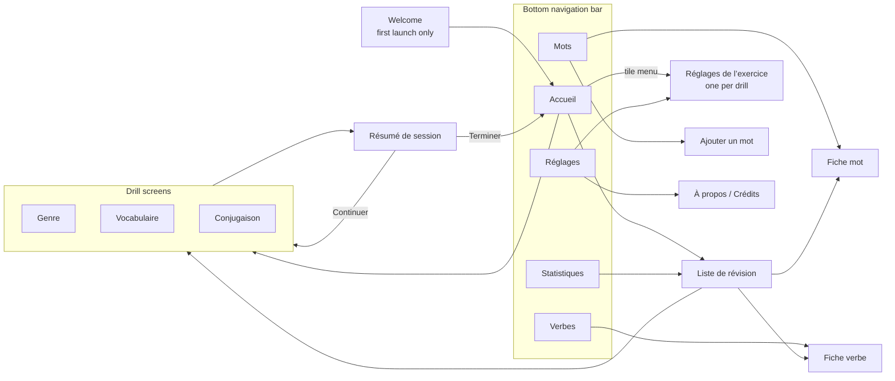

# BAH Français Specification

*Specification for the BAH Français app. Last updated 22 September 2026.*

## Goal

Help people learn and maintain French by giving them a fast, focused alternative to doomscrolling on their phones. A session is short enough to fit into any spare moment, self-paced, and free of forced pacing, streaks, or social pressure.

The app serves the full range of self-directed learners — true beginners building a first vocabulary, false beginners knocking the rust off, and intermediate learners maintaining and expanding what they already know — by letting each person choose the content and categories they focus on, rather than pushing everyone through one fixed curriculum.

Other than the welcome screen, the entire app is in French, to support immersion from the first session.

### Generic principles

No picking drill duration or number of words — the user presses start and does as many as they like, so a session can be stopped at any time.

### What's in scope (Phase 1)

- Written vocabulary, grammatical gender, and verb conjugation, practiced through typed recall and recognition, scheduled with spaced repetition.
- A built-in, curated word/verb list, organized into categories/topics that learners can prioritize based on their interests and level.
- Letting users extend that list with their own words, images and sentences, and weight which categories they see more new cards from.
- Updating the curated list without rebuilding the app, through a content pack the user chooses to download (see Content updates).

### Explicitly out of scope for now (non-goals)

- Listening and speaking practice — Phase 1 is reading + typed recall only. The speaker icon in the layouts belongs to a much later phase, so no card plays audio and no French voice is used in Phase 1.
- An in-app way to suggest new words or corrections — a later phase. In Phase 1, content changes reach the curated list through GitHub pull requests and issues, outside the app.
- Any fixed curriculum, levels, or content unlocking — learners choose their own mix.
- Streaks, badges, leaderboards, or any social/competitive mechanics — pure utility, no engagement engineering.
- Accounts, cloud sync, or any data leaving the device by default.

### What success looks like

- People reach for this instead of a scrolling app in idle moments, because starting a session has near-zero friction.
- Vocabulary and conjugations genuinely stick — measured by FSRS retention and stability, not by streaks or time-on-app.
- The curated word/verb list grows over time without needing an app rebuild, through content packs.

## Spaced Repetition

### Algorithm

The app uses **FSRS** (Free Spaced Repetition Scheduler) for all scheduling. Use the fsrs Dart package from pub.dev (open-spaced-repetition/dart-fsrs) rather than implementing the algorithm by hand. If that package is unavailable or out of date, port the reference implementation (py-fsrs) and verify it against the reference test vectors.

Each card stores its own FSRS state: difficulty, stability, due date, last review, reps, lapses and state (new / learning / review / relearning). Use the package's default parameters. Keep a separate parameter set per drill type so each drill can be tuned independently in a later phase.

### Cards

A card is one item in one drill. The same word therefore has separate, independently scheduled cards in the Gender drill and the Vocab drill.

| Drill | Card = | Prompt | Answer |
| --- | --- | --- | --- |
| Gender | one noun | word and/or image | masculin / féminin / les deux |
| Vocab | one noun | image | typed word (with article if mandatory) |
| Conjugation | one verb × one tense | sentence, infinitive, tense | typed conjugated form |

For conjugation cards, the grammatical person (je, tu, il/elle, nous, vous, ils/elles) is picked at random on each review from the sentences available for that verb and tense. This keeps the number of cards manageable while still covering all forms.

### Grading

Answers are graded automatically into the four FSRS ratings. The user never has to rate themselves.

**Gender drill:** correct = Good, wrong = Again.

**Vocab and Conjugation drills:**

- Exact correct answer = Good.
- Correct except for accents (é/e, è/e, ç/c, etc.), or with a correct word but the wrong article when the article is mandatory = Hard. The correct answer is shown with the error highlighted.
- Anything else = Again.
- If live green/red feedback is on and any letter turned red during typing, the maximum possible grade is Hard, even if the user corrected it before submitting.

**Answer normalisation before comparison:** trim whitespace, ignore case, and treat ’ and ' as identical. Accept alternative valid forms listed in the content data, for example je paie / je paye.

**User overrides:** after each answer, show two small optional buttons.

- "Faute de frappe" (typo) is shown after a wrong answer and changes the grade to Hard.
- "Trop facile" (too easy) is shown after a correct answer and changes the grade to Easy.

### Session flow

In keeping with the generic principles, the user presses start and answers as many cards as they like. Every answer is saved immediately, so a session can be stopped at any moment, including by closing the app, without losing progress.

Cards are served in this order:

1. **Learning steps:** new or failed cards being learned in this session. A new card is shown again after about 1 minute, then about 10 minutes, before FSRS takes over. Failed review cards get one 10-minute relearning step.
2. **Due reviews,** with the lowest recall probability (retrievability) first.
3. **New cards,** interleaved with reviews at roughly 1 new card per 4 reviews, up to the daily new-card limit.
4. **Free practice:** when nothing is due and the new-card limit is reached, show a short message ("Tout est à jour !") and let the user continue with the cards they are closest to forgetting. These early reviews go through FSRS normally, since it handles early reviews correctly.

The "day" resets at 04:00 local time. Intervals include FSRS fuzz so cards learned together don't all fall due on the same day.

Times are stored in UTC and converted to local time to decide which day a review belongs to. If the phone's clock, timezone or daylight saving changes, the new local time simply applies from then on: a day can therefore be shorter or longer than 24 hours, and the daily new-card count for that day is not recalculated. Reviews already logged are never rewritten. Unit tests cover a timezone change mid-session, a daylight-saving change, and the clock going backwards.

### Settings

Each drill settings screen includes:

| Setting | Default | Range |
| --- | --- | --- |
| Nouvelles cartes par jour (new cards per day) | 15 | 0–100 |
| Révisions max par jour (max reviews per day) | unlimited | unlimited or 10–999 |

A global setting, on the Réglages screen, controls:

| Setting | Default | Range |
| --- | --- | --- |
| Rétention visée (target retention) | 90% | 80–97% |

Include a one-line French explanation: a higher target means more reviews but less forgetting.

### Leeches

A card failed (rated Again) 8 times in total is flagged as a leech ("mot difficile"). Leeches stay in rotation but appear in the Review List. Future phases may offer mnemonics or extra example sentences for them.

### Mastery levels

A display-only level derived from FSRS stability, shown in the Word List, Verb List and Stats screens:

| Level | Condition |
| --- | --- |
| Nouveau | never reviewed |
| En apprentissage | learning or relearning state |
| Fragile | stability < 7 days |
| Acquis | stability 7–90 days |
| Maîtrisé | stability > 90 days |
| Connu | marked known by the user (see Activities → Je le connais) |

These levels never affect scheduling.

### Review List

Due, at-risk (retrievability below 80%) and leech cards are listed on the Liste de révision screen; see Screens.

### Data model

All data is stored locally in SQLite (Drift). Nothing ever leaves the device, in line with the offline and no-tracking principles.

**Card:** id, item\_id, drill\_type, FSRS state fields, lapses, tense (Conjugation cards only), is\_leech, known\_at (set when the user marks the card known; null otherwise; cards with known\_at set are never scheduled), created\_at.

**ReviewLog** (one row per answer, never deleted): card\_id, session\_id, timestamp, rating, the state before the review, elapsed\_days, scheduled\_days, response\_time\_ms, the typed answer, and error\_type (none / accent / article / wrong / typo\_override / gave\_up).

**Session:** id, drill\_type, start\_time, end\_time, and counts of cards answered, correct and incorrect.

**Image:** id, item\_id, format (svg / png / jpeg), data (SVG markup as TEXT, or the encoded bytes as a BLOB), source, created\_at. An item can have any number of images. See Activities → Images.

The review log feeds the Stats screen and enables per-user parameter optimisation later.

**Migrations:** the database has a schema version, and every schema change ships with a Drift migration and a test that opens a database from the previous version and checks the data survives. A user's review history cannot be recreated, so no change may drop or rebuild a table holding it.

**If the app is deleted,** its data goes with it. Phone backups (iCloud, Android backup) include the database, so a new phone restores progress; export and import to a file come in a later phase. The Welcome screen says this in one line, so nobody is surprised.

### Later phase

- **Per-user optimisation:** once a drill has at least 1,000 reviews, re-fit that drill's FSRS parameters on-device from the review log (for example with fsrs-rs via flutter\_rust\_bridge). Until then, use the default parameters.
- **Export and import** of cards and review logs to a file, for backup and device transfer.

### Acceptance criteria

- Scheduling logic has unit tests using an injectable clock. These cover each rating from each card state, early and late reviews, the 04:00 day boundary, the daily new-card limit, and leech flagging.
- Grading has unit tests covering exact match, accent-only errors, wrong article, alternative forms, apostrophe normalisation, and the red-letter cap.
- Force-closing the app mid-session loses no answered cards.
- All scheduling works with no network connection.
- All user-facing text is in French, except the welcome screen.

## Content

All words, verbs, sentences and images live in the app's SQLite database, in the tables below, alongside the Card, ReviewLog, Session and Image tables from Spaced Repetition → Data model. Official content arrives through content packs (see Content updates); the user's own content uses the same tables with source = perso.

### Content model

Every official row has a stable string id that is never changed or reused (e.g. `n.table`, `v.aller`, `s.aller.pc.1p.01`). Perso rows get a generated id prefixed `p.`. Every content table also has `source` (official / perso) and `retired` (bool) unless noted.

| Table | Columns | Notes |
| --- | --- | --- |
| Category | id, name, kind (noun / verb), sort\_order | e.g. *La cuisine*; a verb category could be *Verbes essentiels* |
| Noun | id, word, gender (m / f / both), elides (bool), plural\_only (bool), definition, gloss, synonyms (JSON array), ending\_hint, level, rank | elides = takes *l’*; level = débutant / intermédiaire / avancé; rank = frequency, 1 = most common |
| NounCategory | noun\_id, category\_id | a noun can be in several categories |
| NounExample | id, noun\_id, text | at least one per noun |
| Verb | id, infinitive, group (er / ir / re / irr), auxiliary (avoir / être), pronominal (bool), level, rank |  |
| VerbCategory | verb\_id, category\_id |  |
| VerbForm | verb\_id, tense, person, form, alternatives (JSON array) | person = 1s 2s 3s 1p 2p 3p; compound tenses store the masculine singular form (*suis allé*) |
| Sentence | id, verb\_id, tense, person, text, answer, alternatives (JSON array) | text contains `___` once; answer includes agreement (*sommes allés*) |
| CategoryWeight | drill\_type, category\_id, weight (jamais / moins / normal / plus) | no row = normal; not content, never touched by updates |
| ContentMeta | key, value | content\_version, released\_at, schema\_version; no source/retired |

- **Tense** values: `present`, `passe_compose`, `imparfait`, `futur_simple`. Adding a tense later adds values only, never columns.
- **Card** gains a nullable `tense` column: set for Conjugation cards (one verb × one tense), null otherwise. item\_id points to a Noun for Gender and Vocab cards and to a Verb for Conjugation cards.
- The 3s and 3p persons cover *il / elle / on* and *ils / elles*; the sentence decides which.

### Content files

The source files in `content/` (see Content updates) are JSON in UTF-8, one noun category or one verb per file, with fields matching the tables above. The build tool turns them into the content pack. A JSON Schema for each file type lives in `content/schema/`, and the validator uses it.

**Noun category** — `content/nouns/cuisine.json`:

```json
{
  "category": { "id": "cat.cuisine", "name": "La cuisine", "kind": "noun", "sort_order": 3 },
  "nouns": [
    {
      "id": "n.fourchette",
      "word": "fourchette",
      "gender": "f",
      "elides": false,
      "level": "debutant",
      "rank": 412,
      "definition": "Couvert à dents pour piquer les aliments.",
      "synonyms": [],
      "examples": ["Il mange ses pâtes avec une fourchette."],
      "images": ["fourchette-1.svg", "fourchette-2.svg"],
      "also_in": ["cat.objets"]
    }
  ]
}
```

**Verb** — `content/verbs/aller.json` (forms abbreviated):

```json
{
  "id": "v.aller",
  "infinitive": "aller",
  "group": "irr",
  "auxiliary": "etre",
  "pronominal": false,
  "level": "debutant",
  "rank": 5,
  "categories": ["cat.verbes-essentiels"],
  "forms": {
    "present": { "1s": "vais", "2s": "vas", "3s": "va", "1p": "allons", "2p": "allez", "3p": "vont" },
    "passe_compose": { "1s": "suis allé", "...": "..." }
  },
  "sentences": [
    { "id": "s.aller.pc.1p.01", "tense": "passe_compose", "person": "1p",
      "text": "Hier, nous ___ au cinéma.", "answer": "sommes allés" }
  ]
}
```

- Image filenames refer to `content/images/<noun id without n.>/`; the build tool stores each SVG in the Image table.
- Alternatives are written as `"alternatives": ["paye"]` on a sentence or `"alt": {"1s": ["paye"]}` beside a tense's forms.
- **Validator rules** beyond the schema: every id unique; every noun has an image or a definition; every verb has a form for all four tenses × six persons and at least one sentence per tense × person; every sentence has exactly one `___`; a sentence's answer starts with the stored form or one of its alternatives, allowing for agreement; SVG rules from Activities → Images.

### Category weighting and new-card order

Each drill's settings let the user set every category to one of four weights. Weights change which **new** cards come up; reviews of cards already learned always continue, except for Jamais.

| Weight | Share of new cards | Reviews |
| --- | --- | --- |
| Jamais | none | paused: the category's cards are not scheduled |
| Moins | 0.5× | continue |
| Normal (default) | 1× | continue |
| Plus | 2× | continue |

- **Picking a new card:** choose a category at random, weighted as above, among the categories that still have new cards for that drill. Within it, take the next new card by level (débutant → intermédiaire → avancé), then by rank (most common first). With no starting-level question, this is what gives beginners the basic words first; anyone who knows them taps *Je le connais*.
- **Nouns in several categories:** a noun is scheduled unless *all* its categories are set to Jamais, and its weight is the highest of its categories.
- **Setting a category back from Jamais** resumes its cards with their FSRS state; overdue cards simply come back as due.
- The daily new-card limit applies across all categories of a drill, not per category.

### Phase 1 content

Phase 1 launches with about 450 nouns in 15 categories and 60 verbs. The project owner supplies this content and the SVG images; Claude Code does not write the real word list.

| Category (id) | Nouns (target) |
| --- | --- |
| La maison (cat.maison) | 30 |
| La cuisine et les repas (cat.cuisine) | 30 |
| La nourriture et les boissons (cat.nourriture) | 40 |
| Les vêtements (cat.vetements) | 25 |
| Le corps et la santé (cat.corps) | 30 |
| La famille et les gens (cat.gens) | 30 |
| La ville et les magasins (cat.ville) | 30 |
| Les transports et les voyages (cat.transports) | 30 |
| La nature et le temps qu’il fait (cat.nature) | 30 |
| Les animaux (cat.animaux) | 30 |
| Le temps et le calendrier (cat.calendrier) | 25 |
| L’école et le travail (cat.travail) | 30 |
| Les loisirs et le sport (cat.loisirs) | 30 |
| Les objets du quotidien (cat.objets) | 30 |
| Les idées et les sentiments (cat.idees) | 30 |

- **Verbs:** the 60 most frequent French verbs, including *être, avoir, aller, faire, pouvoir, vouloir, venir, prendre, dire, savoir, voir, devoir, mettre, parler, manger, finir* and at least 5 pronominal verbs (*se lever, s’appeler…*). Minimum one sentence per verb × tense × person: 60 × 4 × 6 = 1,440 sentences.
- **Images:** concrete nouns get at least one SVG; abstract nouns (mostly *Le temps et le calendrier* and *Les idées et les sentiments*) use their definition.
- **Quality:** every word, gender, form and sentence is checked by a fluent French speaker before it ships, since a wrong gender or form teaches a mistake.
- **What Claude Code builds:** the content schema, validator and pack builder, plus a small **sample set** in `content/sample/` (3 categories × 10 nouns and 5 verbs with all forms and sentences) used for development and tests. The sample set is replaced by the real content before release and must never ship.

## Content updates

The official word and verb lists are updated by downloading a new content pack, only when the user taps **Mettre à jour le contenu** in Réglages. The app never checks for updates on its own, and the download sends no identifiers or user data.

### Where content comes from

- **Source files** live in the app's GitHub repo under `content/`: one JSON file per noun category (`content/nouns/<category>.json`), one per verb (`content/verbs/<infinitive>.json`), and SVGs in `content/images/<item_id>/`. Contributors add or fix content by pull request, which is where all content contributions land.
- **Build:** a Dart command-line tool in `tool/` validates every file (required fields from Activities → Content each item needs, SVG rules from Activities → Images, unique ids) and builds a **content pack**: one SQLite file with the same content tables as the app, images included. CI runs the validator on every PR.
- **Publishing:** pushing a tag `content-vN` makes CI build the pack and upload it, with a manifest, to a GitHub release named `content-latest`, replacing the previous assets. The app reads from that one fixed URL, set in a single constant.
- **Bundled copy:** every app build ships with the content pack that was current at build time, so a fresh install works fully offline.

### Manifest

`content-manifest.json`, fetched first so the user sees what's new before downloading the pack.

| Field | Example | Purpose |
| --- | --- | --- |
| content\_version | 14 | increases by 1 with each publish |
| min\_app\_schema | 2 | lowest app content-schema version that can read this pack |
| pack\_url | …/content-pack-v14.sqlite | the file to download |
| size\_bytes | 2 400 000 | shown to the user before downloading |
| sha256 | … | checked after download |
| released\_at | 2026-10-01 | shown in Réglages and À propos |
| summary | +120 mots, +40 phrases, 15 corrections | French summary shown before downloading |

### Update flow

1. The user taps **Mettre à jour le contenu**. The app fetches the manifest.
2. Depending on the result, it shows one of:
   - *Le contenu est à jour* — content\_version is not higher than the installed one.
   - *Version 14 disponible : +120 mots, +40 phrases, 15 corrections (2,4 Mo)* with **Télécharger** and **Plus tard**.
   - *Mettez à jour l’application pour recevoir ce contenu* — the pack needs a newer app.
   - *Pas de connexion* — the request failed; nothing changes.
3. On **Télécharger**: download the pack with a progress bar, check its sha256, validate it, then merge it into the app database (rules below) in a background isolate.
4. Show a result line (*Contenu mis à jour : version 14*) and return to Réglages. Drills can't be started during the merge, which should take a few seconds at most.

Any failure (download interrupted, checksum mismatch, invalid pack, app closed mid-merge) leaves the installed content exactly as it was, and a later tap starts over. The downloaded file is deleted once merged or rejected.

When the app itself is updated, its bundled pack goes through the same merge on first launch if its content\_version is higher than the installed one.

### First launch

A fresh install starts with an empty database and the bundled content pack, which has to be imported before any drill can run.

- On the very first launch, the app imports the bundled pack in a background isolate while the Welcome screen is on screen, which is usually enough time to finish it.
- If the user reaches Accueil before the import is done, the drill tiles are disabled and show *Préparation du contenu…* with a progress indicator. Nothing else is blocked.
- An import interrupted by the app closing leaves nothing behind and starts again on the next launch, since it runs in one transaction.
- Importing roughly 450 nouns, 60 verbs and their images should take a few seconds. It is measured in a test with the full content pack, and treated as a defect above 10 seconds on a mid-range phone.

### Merge rules

The app always receives the full pack and works out the differences itself, by stable id. Every official item, sentence and image has an id that is never changed or reused.

| Change in the pack | What the app does |
| --- | --- |
| New item | adds it and creates its cards as New; a new category starts at Normal in every drill |
| Changed text only (example sentence, definition, synonyms, category) | updates the content; cards keep their FSRS state |
| Changed answer (gender, spelling, conjugated form) | updates the content and resets the affected cards to New, because the user may have learned the wrong answer |
| Item removed | marks it retired: hidden from lists and never scheduled, but kept so review logs stay valid |
| Image added, changed or removed | applied by image id |
| Sentence added, changed or removed | applied by sentence id; a conjugation card with no sentences left for a tense and person uses the others |

The merge never touches the user's own words and sentences, *Je le connais* marks, leech flags, category weighting, settings or review logs. A Perso word may end up duplicating a new official one; both are kept. The whole merge runs in one database transaction.

### Versions shown to the user

Réglages shows the installed content version and date under the button (*Contenu : version 14 · 1 oct. 2026*). À propos shows the same.

### Tests

Unit tests cover each merge rule, user data left untouched, the transaction rolling back on a failure mid-merge, a checksum mismatch, a pack needing a newer app, and the bundled pack being applied after an app update. The content validator has its own tests and runs in CI.

## Screens

Five are reached from a bottom navigation bar; drills and their summaries open full-screen with no navigation bar. This section says what each screen shows and where it leads. Behaviour already defined in Spaced Repetition and Activities is referenced, not repeated.

### Navigation



The back gesture always returns to the previous screen. Leaving a drill by back gesture behaves exactly like tapping ×.

### Screen index

| Screen | Reached from | Purpose |
| --- | --- | --- |
| Welcome | first launch | explain the app, crash-report opt-in |
| Accueil | nav bar | start a session |
| Genre / Vocabulaire / Conjugaison drill | Accueil, Liste de révision | answer cards |
| Résumé de session | ending a drill | cards answered, % correct, duration |
| Réglages de l’exercice (×3) | Réglages, Accueil tile menu | per-drill settings |
| Liste de révision | Accueil, Statistiques | due, at-risk and difficult cards |
| Mots | nav bar | browse, search and add nouns |
| Fiche mot | Mots, Liste de révision | one noun: content and card status |
| Verbes | nav bar | browse and search verbs |
| Fiche verbe | Verbes, Liste de révision | one verb: conjugation tables and card status |
| Statistiques | nav bar | progress from the review log |
| Réglages | nav bar | app-wide settings |
| À propos / Crédits | Réglages | version, licence, image credits |
| Ajouter un mot | Mots | add your own noun |

### Welcome

Shown once, on first launch, and the only screen in English. It takes under 30 seconds and ends on Accueil.

- **Three short lines** on what the app is: short self-paced sessions, spaced repetition, no streaks or tracking, works offline, and everything after this screen is in French.
- **One line on skipping known words:** there is no placement test; any word you already know can be removed from practice with one tap on *Je le connais*.
- **One line on your data:** everything stays on this phone and is included in its backups; deleting the app deletes your progress.
- **Crash reports** toggle, off by default, with one line saying reports are anonymous stack traces only. This is the one-time opt-in prompt from the Tech Stack section.
- **Commencer** button → Accueil. Every category starts at Normal.
- While this screen is open, the bundled content pack is imported in the background (see Content updates → First launch).

### Accueil

The home screen. Layout and session types are defined in Activities → Starting a session. In addition:

- Each drill tile has a ⋮ menu with one item, **Réglages de l’exercice**.
- Below the tiles, a text link **Liste de révision** opens the Review List.
- When nothing is due, the due line reads *Tout est à jour* and Commencer still works (free practice, per Session flow).
- If every category is set to Jamais for a drill, its tile is disabled with the line *Aucune catégorie choisie*, and tapping it opens that drill's settings.

### Drill screens (Genre, Vocabulaire, Conjugaison)

One screen layout, with the prompt and answer area specific to each drill (see Activities). Each drill screen has these states:

| State | What the user sees |
| --- | --- |
| Question | top bar (×, cards answered), prompt, answer area |
| Feedback | the feedback panel from Activities → Shared drill behaviour |
| Tout est à jour | a one-line message shown once, above the next card, when the session moves into free practice |
| Nothing to show | *Aucune carte disponible* and a button to the drill's settings, if every category is off or no content exists |

- In a **mixed session**, a small label under the top bar names the current drill (Genre / Vocabulaire / Conjugaison).
- A session started from the **Liste de révision** ends by itself when that group's cards are done, then shows the summary.
- **Leaving the app:** returning within 30 minutes resumes the same card. After 30 minutes the session is closed (end\_time = time of the last answer) and the next start opens a new one.

### Résumé de session

Shown when the user taps × or a Review List session runs out.

- Cards answered, % correct, duration. In a mixed session, the same three numbers per drill underneath.
- **Terminer** → Accueil. **Continuer** → back into the same session.
- If no card was answered, there is no summary and no Session row is saved; × goes straight to Accueil.

### Réglages de l’exercice

One screen per drill, reached from Réglages or the tile menu on Accueil. A mixed session uses each drill's own settings.

| Setting | Genre | Vocabulaire | Conjugaison | Default |
| --- | --- | --- | --- | --- |
| Nouvelles cartes par jour | ✓ | ✓ | ✓ | 15 (0–100) |
| Révisions max par jour | ✓ | ✓ | ✓ | unlimited |
| Catégories (Jamais / Moins / Normal / Plus) | ✓ | ✓ | ✓ | Normal |
| Afficher l’image | ✓ |  |  | on |
| Article obligatoire |  | ✓ |  | off |
| Correction en direct |  | ✓ | ✓ | on |
| Temps (présent, passé composé, imparfait, futur simple) |  |  | ✓ | all on |
| Groupes de verbes (-er, -ir, -re, irréguliers) |  |  | ✓ | all on |

Changes apply from the next card; cards already scheduled keep their due dates.

### Liste de révision (Review List)

Three groups, each with a count and the first few items:

- **À réviser aujourd’hui** — cards due today, split by drill.
- **À risque** — cards with retrievability below 80%.
- **Mots difficiles** — leeches (see Spaced Repetition → Leeches).

Tapping a group starts a drill session limited to those cards; for a group spanning drills, it is a mixed session. Tapping an item opens its Fiche mot or Fiche verbe. An empty group shows *Rien ici pour l’instant*.

### Mots (Word List)

Every noun, official and the user's own.

- **Search** field at the top. Matching ignores case and accents (*ecole* finds *école*).
- **Filters:** category, mastery level (including *Connu*), source (Officiel / Perso), and *Mots difficiles* only.
- **Row:** the word with *un/une*, its category, and two mastery chips, one for Genre and one for Vocabulaire. Leeches carry a small marker; known words show *Connu*.
- **Sort:** alphabetical (default) or by mastery level, weakest first.
- A **+** button opens Ajouter un mot.

### Fiche mot (word detail)

- All the word's images (swipe between them) or its definition, the word with *un/une*, gender, synonyms, example sentences, category and level.
- **Card status** for Genre and Vocabulaire: mastery level, next due date, number of reviews and lapses, and whether it is a mot difficile.
- **Je le connais / Remettre en révision:** marks the word known (same effect as the drill button), or brings a known word back into practice.
- **Actions on the user's own words:** *Modifier*, *Supprimer*, and *Ajouter une image* / *Retirer l’image* (see Activities → Images). Deleting a word deletes its cards; its review log rows are kept.
- Official words have no edit actions in Phase 1; corrections to them go through GitHub.

### Ajouter un mot (add a word)

A form that creates a Perso noun and its Genre and Vocabulaire cards as new cards.

| Field | Required | Notes |
| --- | --- | --- |
| Mot | yes | if it already exists, show a warning with a link to its Fiche mot |
| Genre | yes | masculin / féminin / les deux |
| Image | no | one or more, chosen from the phone (see Activities → Images) |
| Définition | unless an image was added | used as the Vocabulaire prompt when there is no image |
| Phrase d’exemple | yes |  |
| Synonymes | no | comma-separated |
| Catégorie | yes | an existing category, or *Perso* (default) |

### Verbes (Verb List)

- Search, filters (category, verb group, mastery level, *Mots difficiles* only) and sort work as in Mots.
- **Row:** infinitive, group, and one mastery chip per enabled tense.
- There is no + button: new verbs arrive only through content updates in Phase 1, because each one needs a full conjugation table.

### Fiche verbe (verb detail)

- Infinitive, group and auxiliary.
- One section per tense: the six persons with their forms (alternatives shown, e.g. *je paie / je paye*), the card status (mastery level, next due date, reviews, lapses), and that tense's sentences.
- Each tense section has **Je le connais** or **Remettre en révision**, acting on that verb × tense only.
- **Ajouter une phrase:** the user picks a tense and person and writes a sentence with *\_\_\_* where the verb goes. The expected answer is filled in from the conjugation table and can be edited for agreement (*allées*). The sentence joins the pool used for that card.
- Users can add sentences but not new verbs, since a verb needs all 24 forms; new verbs arrive through content updates.

### Statistiques

Read-only, built entirely from the review log and sessions. A selector at the top filters to all drills or one drill.

| Block | What it shows |
| --- | --- |
| Aujourd’hui | cards reviewed, new cards learned, % correct, time spent |
| Rétention réelle | % of review-state cards answered correctly over the last 7 and 30 days, next to the target retention |
| Niveaux | number of cards at each mastery level (Nouveau → Maîtrisé) |
| Prévisions | cards due on each of the next 7 days |
| Temps | total time spent in the last 7 and 30 days |
| Sessions | past sessions, newest first: date, drill, duration, cards answered, % correct |
| Mots difficiles | number of leeches; tapping it opens the Liste de révision |

There is no calendar heatmap or “days in a row” count, since those work like streaks.

### Réglages

App-wide settings, in this order:

- **Rétention visée** — 80–97%, default 90%, with the one-line explanation from Spaced Repetition → Settings.
- **Réglages des exercices** — three entries: Genre, Vocabulaire, Conjugaison.
- **Mettre à jour le contenu** — checks for and installs a new content pack, with the installed content version and date underneath (see Content updates).
- **Thème** — Système / Clair / Sombre, default Système.
- **Rapport de plantage** — off by default, with a short French explanation (anonymous stack traces via Sentry, no personal data, no analytics). Can be switched at any time.
- **À propos** — opens À propos / Crédits.

### À propos / Crédits

App version, the MIT licence, a link to the GitHub repo, open-source licences of the packages used (Flutter's built-in licence page), and image credits built from each image's source field.

## Activities

Phase 1 has three drills: Gender, Vocabulary and Conjugation. They share one card layout, one feedback panel and one set of typing rules. Scheduling and grading are defined in Spaced Repetition; this section defines what the user sees and does.

### Starting a session

The home screen (Accueil) has one large **Commencer** button and, below it, three smaller tiles: **Genre**, **Vocabulaire**, **Conjugaison**.

- **Commencer** starts a mixed session. It builds one queue from all three drills, using the order in Spaced Repetition → Session flow, and interleaves drill types so the same word never appears in two drills back to back.
- A **drill tile** starts a session with that drill only.
- Under each tile, one line shows how many cards are due today (e.g. *12 à réviser*). No other numbers are on the home screen.

### Shared drill behaviour

- **Layout:** prompt at the top, answer area below, one primary button in the thumb zone. The top bar shows only a close button (×) and the number of cards answered this session. There is no progress bar, because a session has no target.
- **Feedback panel:** appears after each answer. It shows the result (Correct / Presque / Incorrect) with an icon as well as colour, the correct answer with any error highlighted, one example sentence, the relevant override button (Faute de frappe or Trop facile), and a **Suivant** button.
- **Advancing:** a correct answer in the Gender drill auto-advances after 1 second. Everything else waits for Suivant, so the user has time to read the correction.
- **Response time:** measured from the prompt appearing to the answer being submitted, and stored in the review log.
- **Ending a session:** tapping × shows a one-screen summary (cards answered, % correct, duration) with a **Terminer** button. No praise, animation or comparison with earlier sessions.
- **Drill settings (all drills):** new cards per day, max reviews per day (see Spaced Repetition), and category weighting (Jamais / Moins / Normal / Plus; see Content → Category weighting).

### Je le connais (mark as known)

Every drill has a **Je le connais** button so a learner can drop words they already know in one tap. There is no placement test, so nothing is skipped on assumption: a word leaves practice only when the user says so.

- **Where:** a small text button at the top right of the card, shown in both the Question and Feedback states. It is secondary to the main answer action.
- **Nouns:** marks the word known in every drill, so its Genre and Vocabulaire cards are both removed.
- **Verbs:** marks only the current verb × tense known (e.g. *être* at présent), because knowing one tense doesn't mean knowing the others. Other tenses of the verb stay in practice.
- **Effect:** the affected cards are never served again, in any session type, and don't count towards due counts, new-card limits or the Liste de révision. Their FSRS state is kept but frozen.
- **No grade:** marking a card known doesn't count as an answer, isn't in % correct, and writes no rating to the review log, so it never distorts FSRS or later optimisation.
- **Undo:** the next card appears at once, with a snackbar *Marqué comme connu · Annuler* for 5 seconds. There is no confirmation dialog, to keep it fast.
- **Bringing it back:** the Fiche mot or Fiche verbe has *Remettre en révision*. The card resumes with its previous FSRS state, or as a new card if it was never reviewed.

### Typing behaviour (Vocabulary and Conjugation)

- The text field is focused and the keyboard open as soon as the card appears. Autocorrect, suggestions and auto-capitalisation are off. Enter submits; an empty answer cannot be submitted.
- **Accent bar** above the keyboard: é è ê ë à â ç ù û î ï ô œ ’. Tapping a key inserts it at the cursor.
- **Live feedback** (setting "Correction en direct", default on): each letter is checked as it is typed against every accepted form of the answer, after normalisation.
  - A letter that matches is green and underlined.
  - A letter that is right apart from its accent is orange with a dotted underline.
  - Once any letter is wrong, all letters turn red and a ✗ icon appears beside the field. Deleting back to a correct prefix turns them green again.
  - Any red or orange letter during typing caps the grade at Hard, even if corrected before submitting.
- **Je ne sais pas:** a secondary button under the field. It grades the card Again, logs error\_type gave\_up, and shows the answer.

### Gender drill

- **Prompt:** the noun without an article (e.g. *table*), always shown. If the item has images and "Afficher l'image" is on (default on), one of its images is also shown, chosen at random on each review. There is no image-only mode: the drill tests gender, not recall of the word.
- **Answer:** large symbol tiles at the top of the card, as in the layouts: ♀ féminin, ♂ masculin, and ♀♂ les deux. All three are always shown, so the layout never hints at the answer. An unselected symbol is blue on the background; the chosen one sits on a filled teal tile with the symbol in yellow. Each tile has a screen-reader label (*féminin*, *masculin*, *les deux*).
- **"Les deux"** is only for nouns whose gender follows the person with no change of meaning (un/une élève, un/une enfant). Nouns whose meaning changes with gender (le livre / la livre) are two separate items. Each shows a short French gloss so the prompt is unambiguous.
- **Feedback:** the word with *un/une* (never *l’*, which hides the gender), an example sentence with the noun in bold, and an optional "Astuce" line if the content has an ending rule (e.g. *-tion → féminin*).

### Vocabulary drill

- **Prompt:** one of the item's images, chosen at random on each review. Seeing different pictures of the same word stops the user memorising one picture instead of the word. If the item has no image, the prompt is its short French definition (e.g. *Période de sept jours* → *semaine*).
- Every noun has a Vocabulary card, because every noun has an image or a definition.
- **Answer:** the noun typed in the singular, or in the plural for plural-only nouns (*les ciseaux*).
- **Synonyms:** the content data lists every accepted word for an item (e.g. *voiture / auto*). Any listed word is graded Good.
- **Article obligatoire** (drill setting, default off):
  - When on, the answer must include an article. Accept *le/la/les* or *un/une/des*. For nouns that take *l’*, only *un/une* is accepted, because *l’* doesn't show the gender.
  - A missing or wrong article with the right noun is graded Hard.
  - When off, the article is optional, but a wrong one that is typed is still graded Hard.

### Conjugation drill

- **Tenses in Phase 1:** présent, passé composé, imparfait, futur simple. Conditionnel and subjonctif présent come in a later phase; the data model and settings must allow adding tenses without a schema change.
- **Prompt:** a sentence with the verb blanked out, and underneath it the infinitive and the tense, e.g. *Hier, nous \_\_\_\_ au cinéma.* · **aller** · passé composé. The subject is always in the sentence.
- **Answer:** only the words that fill the blank.
  - Compound tenses: auxiliary + participle, with agreement required by the sentence (*sommes allés*).
  - Reflexive verbs: include the reflexive pronoun (*me lève*).
  - When *je* elides, the blank covers the subject and the answer includes it (*\_\_\_\_ le chocolat* → *j’aime*).
  - Sentences for compound tenses are affirmative, so *ne…pas* never splits the answer.
- **Drill settings:** which of the four tenses are on (all on by default), and which verb categories are included (-er, -ir, -re, irréguliers, plus the content's frequency categories).

### Content each item needs

| Item | Required fields | Optional fields |
| --- | --- | --- |
| Noun | word, gender (m / f / both), categories, level, one example sentence, and at least one image **or** a short French definition | more images, accepted synonyms, gloss, ending-rule hint |
| Verb | infinitive, group, auxiliary, conjugated form per tense and person, at least one blanked sentence per tense and person, categories, level | alternative forms (*je paie / je paye*) |

### Images

Official images are SVGs supplied by the project owner and stored in the database, not as asset files. This allows several images per word, and lets content updates add images without an app rebuild. Users can add their own pictures to their own words.

- **Storage:** an Image table (see Data model) holds the file bytes and its format, linked to the item. An item can have zero, one or many images.
- **Rendering:** flutter\_svg for SVGs, from the stored string; `Image.memory` for PNG and JPEG. Each image is decoded once per session and cached, so showing a card stays instant.
- **Artwork rules** for official images: square (1:1) viewBox, readable at 160 px, no embedded raster images, fonts or scripts, no text in the image, and legible on both light and dark backgrounds. Target under 20 KB each.
- **Validation:** content import rejects any SVG that fails to parse or breaks these rules, and reports which item it belongs to.
- **User images:** on a Perso word, the user picks a picture through the system photo picker, which needs no permission prompt on iOS or modern Android. SVG, PNG and JPEG are accepted. The app re-encodes a raster image to at most 512 × 512 px and 200 KB before storing it, rejects anything it can't decode, and lets the user remove or replace it. User images are never sent anywhere and are skipped by the content merge.
- **Credit:** each official image has an optional source field, listed on the À propos / Crédits screen.

## Tech Stack

**Framework:** Flutter (stable channel), Dart.

**Target platforms:** iOS, Android. Web is a later phase.

**Minimum OS versions:** iOS 15+, Android 8.0 / API 26+.

**State management:** Riverpod (flutter\_riverpod, with riverpod\_generator for code-generated providers). Providers are also the app's dependency-injection mechanism — no separate service locator.

**Architecture:** Feature-first folder structure. Within each feature, a thin separation between data (Drift tables/DAOs), domain (FSRS scheduling, grading, normalisation — pure Dart, no Flutter imports, independently unit-testable), and presentation (widgets + Riverpod providers). The domain layer must be usable and testable with zero UI dependencies.

**Local persistence:** Drift, built on SQLite. Drift's reactive streams feed Riverpod providers directly, so UI updates automatically as cards, sessions, and review logs change.

**Spaced repetition:** fsrs Dart package (open-spaced-repetition/dart-fsrs), per the Spaced Repetition section.

**Routing:** go\_router.

**Strings:** every word the app shows comes from two JSON files kept at the repo root: `strings/strings_fr.json` (the whole app) and `strings/strings_en_welcome.json` (the welcome screen, the one screen in English). The project owner edits these files; they are the source of truth for the app's wording.

In French, a drill is called an **exercice** everywhere the user can see it (*Réglages de l’exercice*, *Tous les exercices*). "Drill" is used only in this spec and in code identifiers.

- A small generator, `tool/gen_strings.dart`, turns them into a typed Dart class (`lib/core/strings.g.dart`) with a constant per key and a method per key that has placeholders. Widgets use that class and never contain literal text.
- Placeholders are written `{n}`, `{version}`, `{date}`, `{size}`, `{drill}`, `{answer}`, `{word}`. The generator fails if a key's placeholders don't match its usage, so a renamed or missing key breaks the build rather than the app.
- **Any new text means a new key first:** add it to `strings_fr.json` (in the section for that screen, following the existing naming), regenerate, then use it. Never hardcode a string, and never invent French wording in a widget.
- CI regenerates the file and fails if the result differs from what is committed, and a test checks that every key in the English file has an equivalent screen in the app.
- Full Flutter intl/gen-l10n is deliberately not used: there is no second interface language planned, so it would be overhead without benefit.

**Testing:** flutter\_test for unit/widget tests, mocktail for mocking, integration\_test for end-to-end flows.

**Linting/formatting:** very\_good\_analysis (or flutter\_lints with stricter additions), enforced via dart format --set-exit-if-changed in CI.

**CI/CD:** GitHub Actions. Every push/PR runs flutter analyze, format check, and flutter test --coverage; PRs are blocked on failure. Coverage is tracked (e.g. via Codecov) with a target of ≥90% on the domain layer.

**Error handling:** No analytics or ad SDKs. Crash reporting is the one exception to the no-tracking stance: Sentry, configured to scrub PII and device identifiers so it only ever reports stack traces — never used for behavioral analytics. It is off by default; the user opts in via a one-time prompt or a settings toggle, the same way the content download only happens when the user asks for it. Debug logs otherwise stay device-local.

**License / hosting:** MIT license, public GitHub repo, with a README (setup + architecture overview), CONTRIBUTING.md, and issue templates for bug reports and content suggestions. Semantic versioning with a CHANGELOG.md.

### Development Principles

- **Clean interfaces** — small, single-responsibility widgets; presentation layer contains no business logic; domain logic (scheduling, grading) stays pure Dart so it can be tested without spinning up the UI.
- **Performance over design** — target a steady 60fps; avoid unnecessary rebuilds (const constructors, Riverpod select); app should be interactive in well under a second from launch, since near-zero friction to start a session is the whole point.
- **No user tracking** — no analytics and no ad SDKs, ever. The only exceptions to "nothing leaves the device" are the user-initiated content download and opt-in crash reporting (Sentry, PII-scrubbed, off by default) — both require the user to actively turn them on, never a background default. The content update is a plain download started by the user; it sends no identifiers or data.
- **Always available offline** — every feature works with no network connection; the only network use is user-initiated: the Mettre à jour le contenu download and opt-in crash reporting.
- **Open source** — MIT-licensed, public repo, documented well enough for an outside contributor to build and run it from the README alone.
- **Testing rigor (high)** — unit tests for all domain logic (FSRS wrapper, grading, answer normalisation) at ≥90% coverage; widget tests for every screen; integration tests for core flows (complete a full drill session, force-close mid-session and confirm no data loss). CI enforces all of this on every PR.

### Design Principles

- **Visual style:** Minimal Material 3. Native, platform-consistent components with light custom theming — fast to build, accessible by default, and deliberately calm rather than branded or attention-grabbing.
- **Light and dark mode:** both supported, following the system setting by default.
- **No engagement engineering in the visuals:** no mascots, confetti, streak counters, or celebratory animations. Motion is minimal and purposeful — e.g. a subtle transition when a card is answered — nothing designed to trigger a dopamine loop.
- **Accessibility:** respects OS text-scaling; WCAG AA color contrast; color is never the sole signal — the green/red typing feedback needs a secondary cue (underline or icon) for colorblind users; all interactive elements have screen-reader labels.
- **Layout:** one primary action visible at a time during drills, generous whitespace, designed for one-handed thumb use — consistent with "pick it up for 30 seconds in a spare moment."

### Color scheme

Three brand colours, from the Layouts document: teal for actions, yellow for the chosen or highlighted thing, and blue, which also gives the dark theme its background. Colour carries meaning here (which answer is selected, whether an answer was right), never decoration.

| Colour | Hex | Role | Text on it |
| --- | --- | --- | --- |
| Turquoise | #6EC9C8 | primary: the main button (Continuer), the selected answer tile, filled indicators | **Navy #14334C** (6.8:1). Never white, which fails at 1.9:1 |
| Jaune | #FACD3F | the symbol or label inside a selected tile, and small highlights | navy (8.6:1); never yellow text on white (1.5:1) |
| Bleu | #5172A1 | unselected answer symbols, secondary icons, links | white (4.9:1); as text it needs a light background |
| Navy | #14334C | the dark theme's background, and text on teal or yellow | white text on it reads at 13:1 |

- **Light theme:** white background with a soft teal-to-white gradient behind the top of the screen, as in the layouts. Text is navy.
- **Dark theme:** navy #14334C background, white text, teal and yellow keep their values. The blue is only used on light backgrounds, since it nearly disappears on navy (2.7:1); use #8FB0DB in its place there.
- **Generating the theme:** `ColorScheme.fromSeed(seedColor: Color(0xFF6EC9C8))` for light and dark, then override `primary` (teal), `onPrimary` (navy), `tertiary` (yellow), `secondary` (blue / #8FB0DB) and the dark `surface` (navy) with the exact values. Do not enable Android dynamic colour, so the brand and feedback colours always sit on predictable backgrounds.
- **Feedback colours** are separate from the brand, fixed, and defined once as a `ThemeExtension`:

| Role | Light | Dark | Used for |
| --- | --- | --- | --- |
| Correct | #1E7A3C | #6FD08C | correct letters, *Correct* result |
| Accent only | #A6520A | #F5B35C | letters right except for the accent, *Presque* result |
| Wrong | #C0362C | #FF8F80 | wrong letters, *Incorrect* result |

- **Contrast:** feedback colours measure 5.4:1 to 5.5:1 on white and 5.9:1 to 7.1:1 on the navy background, meeting WCAG AA. A widget test checks every text and background pair in both themes.
- **Keeping feedback distinct:** the brand yellow is never used near the answer field, so it can't be confused with the orange *accent only* colour. No red or green outside answer feedback, so red always means a wrong answer.
- **Never colour alone:** feedback always carries its cue from Activities (solid underline, dotted underline, ✗ icon, result word), and a selected answer tile is marked by its filled shape, not only by colour.

### Logo, icon and splash

- **Logo:** the cartoon character above the *BAH!* / *FRANÇAIS* wordmark, supplied as PNG and SVG by the project owner. It appears on the Welcome screen and the launch screen only; no header on other screens carries it.
- **Launch screen:** the logo centred on the teal-to-blue gradient from the layouts, with the same gradient behind the Welcome screen.
- **App icon:** the character alone on a plain background, without the wordmark, which is unreadable at icon size. Supplied in the sizes both stores need, with an Android adaptive-icon foreground and background layer.
- The logo is decorative, so it carries a screen-reader label of *BAH Français* and is not read out twice.

### Typography

The whole app uses **Poppins** in three weights, taken from the Layouts document. The font files (Light 300, Regular 400, Bold 700) are bundled as assets under their SIL Open Font License, not fetched at runtime, so the app stays offline.

| Weight | Used for | Example from the layouts |
| --- | --- | --- |
| Light 300 | large display text: the prompt word, the main button label | *chien*, *continuer* |
| Regular 400 | body text, list rows, the answer field, screen titles | *C’est un bon* |
| Bold 700 | the target word inside an example sentence, the result word, emphasis in lists | **chien** |

- Map these onto the Material 3 `TextTheme` once, in the theme; widgets never set a font weight directly.
- Light is only used at 16 sp or larger, since thin strokes are hard to read at small sizes.
- All sizes follow the OS text-scaling setting.

## Build plan

Build in the order below, one milestone at a time. Each milestone ends with its checks passing and a commit; nothing from a later milestone starts before an earlier one is done. The order puts the logic that has to be right first, and the screens on top of it.

### App identity

| Item | Value |
| --- | --- |
| Display name | BAH Français |
| Bundle / application id | com.bahfrancais.app (never changed after the first release: stores treat a new id as a different app) |
| Repo | public GitHub repo, MIT (see Tech Stack) |
| Orientation | portrait only |
| Devices | phones; tablets run the phone layout centred, and are not a design target |
| Backups | the database is included in iCloud and Android backups, so a new phone keeps the user's progress |

### Milestones

| # | Milestone | Done when |
| --- | --- | --- |
| 0 | Project setup: Flutter app, feature-first folders, Riverpod, go\_router, lints, CI, theme (colours, Poppins), the strings files and their generator, app icon, launch screen | CI is green, `flutter analyze` and the format check are clean, and the app launches to an empty Accueil in both themes |
| 1 | Domain core, pure Dart: FSRS wrapper, grading and answer normalisation, the queue builder (session flow, daily limits, weighting, known and Jamais exclusions), mastery levels, injectable clock | every acceptance criterion in Spaced Repetition has a passing test; domain coverage ≥ 90%; no Flutter import in the domain layer |
| 2 | Data layer: Drift tables for cards, logs, sessions, content and images; DAOs and streams; migrations; plus the content validator and pack builder in `tool/`, and the sample content set | the sample pack builds, imports and reads back unchanged; the validator rejects each rule it enforces, with a test per rule |
| 3 | Vocabulaire drill end to end: card screen, typing rules, accent bar, live feedback, Je ne sais pas, Je le connais, feedback panel, session summary | an integration test completes a session; a force-close mid-session loses no answered card; widget tests cover each drill state |
| 4 | Genre and Conjugaison drills, Accueil, and the mixed session | each drill has the same test coverage as milestone 3; a mixed session interleaves drills and respects each drill's limits |
| 5 | Mots, Fiche mot, Ajouter un mot with the image picker, Verbes, Fiche verbe, Ajouter une phrase | a user-added word appears in both drills; a user-added sentence is used by its card; images are stored, shrunk and rendered |
| 6 | Liste de révision, Statistiques, Réglages, the three drill settings screens, Welcome, À propos | every setting changes behaviour from the next card; stats match the review log in a test with seeded data |
| 7 | Content updates: manifest, download, checksum, merge rules, the bundled pack after an app update | every merge rule has a test; a failure mid-merge leaves the content untouched; user data is never modified |
| 8 | Release pass: accessibility (text scaling, screen-reader labels, contrast test), performance (interactive in under a second, steady 60 fps), real content imported, French text reviewed by a fluent speaker, privacy policy published and both stores' privacy forms completed | the release checklist in the README is fully ticked |

### Privacy and store compliance

Both stores ask what an app collects before it can be published, even when the answer is nothing. Prepare these in milestone 8:

- **Privacy policy:** a page on GitHub Pages, linked from both store listings and from À propos. It says the app stores everything on the device, collects nothing, has no accounts and no analytics, that content updates are downloads the user starts, and that crash reports are off unless the user turns them on, PII-scrubbed, and processed by Sentry.
- **Apple privacy labels:** *Data Not Collected* while crash reporting is off by default; if the labels must cover the opt-in path, declare Diagnostics, not linked to identity, not used for tracking.
- **Google Play Data safety form:** the same answers, with crash logs marked optional and explained.
- **No advertising identifier** is requested, and the Android `AD_ID` permission is removed from the merged manifest.
- **Android permissions:** the merged manifest is checked at this milestone, so it holds only `INTERNET` (used by the content download and, when enabled, crash reports). The photo picker needs no permission.
- **Store listing:** French and English descriptions, screenshots in both themes, the app icon, and a content rating questionnaire (the app has no user-generated content shared between users).

### How Claude Code should work

- **One milestone per branch and pull request**, with its tests. Do not start the next milestone in the same PR.
- **Keep `PROGRESS.md`** at the repo root: the current milestone, what is done, what is left, and any decision taken along the way. Update it at the end of every session.
- **All user-facing text comes from the strings files** (see Tech Stack → Strings). Adding a screen or a message means adding keys to `strings/strings_fr.json` first, then using the generated class. No literal text in widgets.
- **Ask instead of guessing.** If the spec doesn't answer something, stop and ask, and write the answer into `PROGRESS.md`. Do not invent a behaviour and move on.
- **Build only what the spec describes.** No extra features, screens, settings or engagement mechanics, however small.
- **Never invent French content.** Only the sample set may contain words and sentences, and they are marked as samples. Real content comes from the project owner.
- **Run `flutter analyze`, the format check and the full test suite** before calling any milestone done.
- **Tests come with the code**, in the same PR, not in a later clean-up pass.
